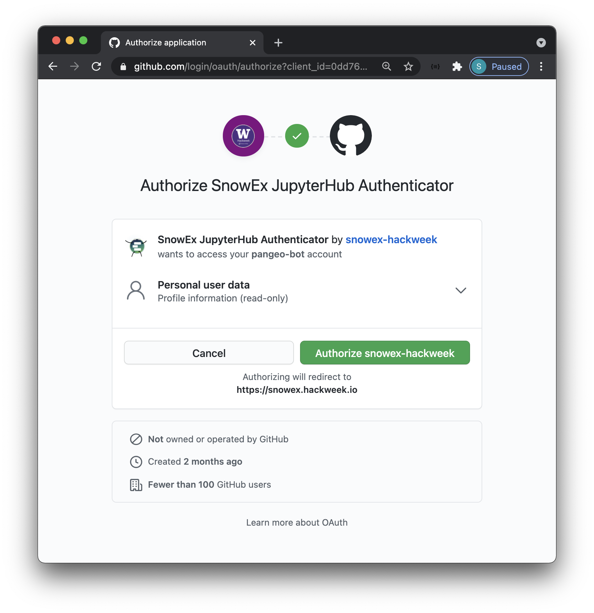

# JupyterHub 

(event-jupyterhub)=
## Why are we using a shared cloud environment?

Teaching software to a diverse group of participants, each with different computers 
and operating systems, can be challenging. As you'll learn in the next lesson, there 
are specific ways to configure our software for the tutorials to be successful, so 
it takes time to get everyone set up consistently. Our solution to this is to give 
everyone access to a cloud computing environment that is pre-configured for the 
specific software we will deploy. This cloud computing instance can be accessed 
from any web browser, which eliminates the need for configuring each person's 
individual computer.

We will encourage you to use our shared resources for all the tutorials, and you 
can optionally use this for your projects as well. We also hope you will practice 
installing Python libraries locally on your laptop so that you can continue working 
after leaving our event.


## How do I access the shared cloud environment?

Access to our shared cloud environment (JupyterHub) is under this URL: {{ jupyterhub_url }}!

### First time login

```{attention}
Before going to {{ jupyterhub_url }} you need to setup your {{ hackweek }}
organization membership correctly. See: {ref}`configure-github`
```

The first time you sign in, you will be asked to authorize the OAuth app as access 
to the JupyterHub is restricted to {{ hackweek }} GitHub Organization members.

```{note}
The screenshots below will not exactly match what you see and you should see your
user information for instance.
```



### After each login

It can take several minutes for new servers to launch on the cloud - be patient! 
Once things are spun up you will see your very own instance of a {term}`JupyterLab` environment:


When you log into JupyterHub you have access to your own virtual drive space
under the `/home/jovyan` directory. No other users will be able to see or access
your data files. You can add/remove/edit files in your virtual drive space.


### How do I end my JupyterHub session?

Stopping the server happens automatically when you navigate
to "File -> Log Out" and click "Log Out"! to end a session.


```{attention}
When you are finished working for the day it is important to explicitly log 
out of your JupyterHub session.
```

The reason for this is it will save us a bit of money! When you keep a session 
active it uses up AWS resources and keeps a series of virtual machines deployed.

###  Will I lose all of my work?

```{important} Logging out
Logging out will **NOT** cause any of your work to be lost or deleted. It simply 
shuts down some resources. It would be equivalent to turning off your desktop 
computer at the end of the day.
```
